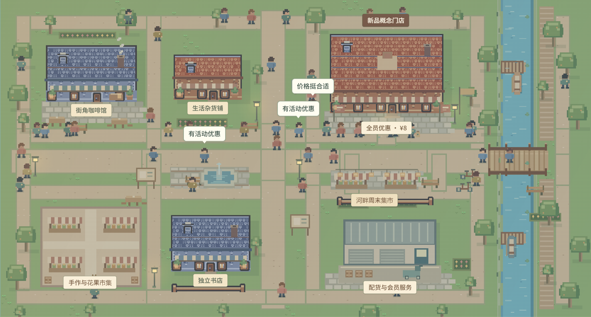

# 智演 ZHIYAN

> 把策略放进城市，先看见下一步。

智演是一套面向经营、增长与公共服务团队的决策��演工作台。它把候选策略、人群画像、城市空间和资源约束放进同一个可观察的场景，帮助团队在真实试点前比较路径、发现边界、形成验证计划。

[进入产品](https://kzczc.github.io/zhiyan-decision-studio/) · [观看 Demo 说明](DEMO-RECORDING.md) · [旧版兼容地址](https://kzczc.github.io/yance-decision-studio/)

## 为什么是智演

很多决策工具只能告诉团队过去发生了什么，讨论会却必须猜测方案落地后会改变谁、改变哪条路径、消耗多少资源。智演把一个问题转化为可观察的城市情境：同一组人群、同一段周期、不同的行动方案，在同一张地图上进行对照。

- 更快：先用可重复的情境预演缩小方案范围。
- 更省：在真实 A/B 测试或现场试点前发现资源与体验风险。
- 更可解释：把指标变化连接到人群、设施、路线与行为反馈。

智演的长期技术方向是将策略放入可校准的大规模多智能体系统中，比较反事实方案并把结果回流到真实实验。目前公开 Demo 是完整的前端产品体验，使用透明、确定性的假设模型，不伪装成已经连接真实数据或后端智能体推理。

## 三个 Lab

| Lab | 面向团队 | 示例问题 |
| --- | --- | --- |
| **PolicyLab** | 政府与公共机构 | 服务网点、开放时段与居民可达性如何变化？ |
| **GrowthLab** | 企业与业务团队 | 新用户引导、产品体验与激活留存如何比较？ |
| **BizLab** | 店主与个体经营者 | 新品促销如何影响客流、订单与贡献毛利？ |

每个 Lab 提供 4 张独立地图，共 12 张；道路、设施、人群路线和场景标签会随地图切换。

## 主要能力

- 情境构成：输入背景，识别地图、天气、光照、客流节奏和设施倾向。
- 城市预演：像素城市、建筑、设施、人物和路线组成可观察场景。
- 人物观察：选择画像、查看行为与目的地、定位并跟随对象。
- 策略比较：对照方案、指标卡、结果解读、资源边界和验证计划。
- 研究记录：本地保存完整情境、策略、人群、地图和界面偏好。
- 导出交付：HTML 报告、CSV 指标表和打印版本。

## Demo 录制

主 Demo 采用“问题 → 情境预演 → 方案比较 → 下一步验证”的结构，以 BizLab 滨水周末集市为主线，并补充 PolicyLab 与 GrowthLab 镜头。

- 高清视频：work/recordings/zhiyan-demo-3min.webm
- 字幕文件：work/recordings/zhiyan-demo-subtitles.vtt
- 章节索引：work/recordings/zhiyan-demo-chapters.json
- 分镜与旁白：DEMO-RECORDING.md

## 快速开始

    node work/serve.cjs

然后打开 http://127.0.0.1:61320/。静态入口是 docs/index.html，无需构建工具。

## 项目结构

- docs/app.js：导航、策略编辑、情境设置、人物观察、研究保存与导出。
- docs/scenarios.js：三类 Lab 的场景参数与确定性测算。
- docs/maps.js：12 张地图的路网、建筑与设施配置。
- docs/town.js：城市渲染、人物、路径、光照、相机和动画。
- docs/assets/：字体、品牌图形、Lab 插画、地图与许可文件。

## 接入边界

当前公开版本是静态前端，研究记录保存在浏览器 localStorage。真实项目接入时，可以把场景配置、人物画像、策略参数和仿真任务提交到后端 API，再返回任务状态、轨迹、聚合指标和可解释事件；接入真实数据前，需要授权、脱敏、模型校准和现场验证。

## 素材与许可

中文字体使用霞鹜文楷屏幕版，英文和数字使用 Inter；图标使用 Lucide；像素地形使用 Kenney Tiny Town（CC0）。许可文件位于 docs/assets/。智演 / ZHIYAN 的名称与图形尚未完成商标可用性核验。
